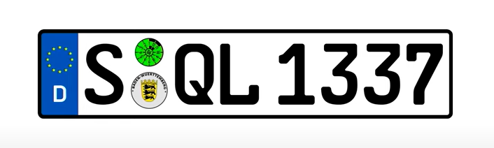
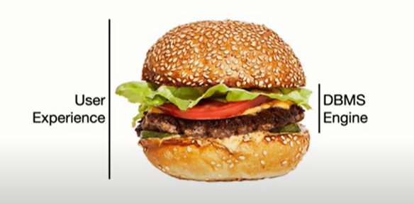
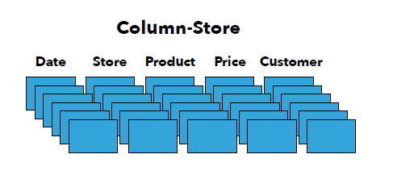
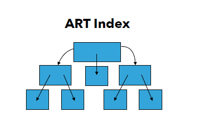
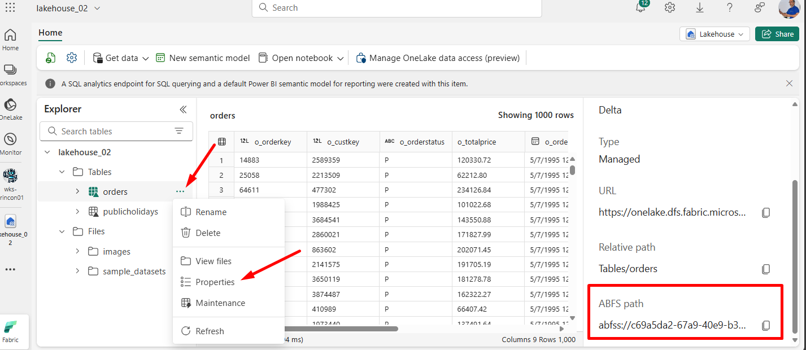

# DuckDB para Desarrolladores

## Diapositiva 1: Portada

Título: DuckDB para desarrolladores: Bases de datos analíticas en local  
Subtítulo: Eladio Rincon, 15-02-24, Logroño

---

## Diapositiva 2: ¿Qué es DuckDB?

- Motor de bases de datos analítico embebido.
- Optimizado para consultas OLAP en local.
- Inspirado en SQLite pero diseñado para análisis de datos.
- Creado en la Universidad de Ámsterdam por Hannes Mühleisen y Mark Raasveldt.
- Integración con Python, R, SQL nativo.
- Soporta CSV, Parquet y Arrow sin necesidad de cargarlos en memoria.
- Sin servidor, embebido, sin dependencias.
- Alta eficiencia en consultas OLAP (columnares, SIMD).

---

## Diapositiva 3: Historia y motivación

- 2019: Creado en la Universidad de Ámsterdam por **Hannes Mühleisen** y **Mark Raasveldt**
- Licencia: Proyecto de código abierto bajo licencia MIT.
- Inspiración: Diseñado como un motor de bases de datos embebido para análisis de datos, inspirado en SQLite pero optimizado para OLAP.
- Principios clave: Arquitectura columnares, procesamiento vectorizado y ejecución eficiente en local sin necesidad de servidor.
- Crecimiento: Rápida adopción en la comunidad de ciencia de datos y análisis de grandes volúmenes de información.
- Integración: Compatible con Python, R y SQL, con soporte nativo para formatos como CSV, Parquet y Arrow.
- Actualidad: Motherduck como SaaS

- Conoce a Hannes: https://www.youtube.com/watch?v=bi0XhmbkqU8
- SQL Data Freek: 
- Interfaces para la BBDD: 

## Diapositiva 4: 3 Elementos diferenciadores

- Column Store



| Característica           | **DuckDB** 🦆 | **PostgreSQL** 🐘 | **SQL Server** 🔵 |
|-------------------------|--------------|----------------|----------------|
| **Almacenamiento Columnar** | ✅ Sí, **nativo** | Con Citus | ✅ Columnstore Index |
| **Compresión**          | ✅ Sí, optimizada para OLAP | Con extensiones | ✅ Batch Mode y compresión avanzada |
| **Optimización de CPU** | ✅ Sí, usa **SIMD y procesamiento vectorizado** | ❌ | ✅ Batch Mode |
| **Ejecución Vectorizada** | ✅ Sí, **por defecto** | ❌  | ✅ Batch Mode |
| **Optimizado para OLAP** | ✅ Sí, diseñado para análisis en local | ❌ | ✅ Columnstore Index |

- Vectoriced processing
  


| Característica           | **DuckDB** 🦆 | **PostgreSQL** 🐘 | **SQL Server** 🔵 |
|-------------------------|--------------|----------------|----------------|
| **Procesamiento Vectorizado** | ✅ Sí, **nativo y siempre activado** | ❌ No soporta ejecución vectorizada | ✅ Sí, pero solo en **Batch Mode** |
| **Tamaño de Bloque (Batch Size)** | 🔹 **1024 valores** por vector | ❌ No aplica | 🔹 **Hasta 900 filas** en Batch Mode |
| **Ejecución en Lotes** (Batch Processing) | ✅ Sí, **por defecto en todas las consultas** | ❌ No soportado | ✅ Sí, pero solo en cargas OLAP |

---

- ART Indexing vs B-Tree



| Característica           | **DuckDB** 🦆 | **PostgreSQL** 🐘 | **SQL Server** 🔵 |
|-------------------------|--------------|----------------|----------------|
| **Índices ART** | ✅ Sí, **por defecto** | ❌ No soporta ART | ❌ No soporta ART |
| **Índices B-Tree** | ❌ No soporta B-Tree | ✅ Sí, **por defecto** | ✅ Sí, **por defecto** |
| **Índices Hash** | ❌ No soporta Hash | ✅ Sí, **por defecto** | ✅ Sí, **por defecto** |

Diferencias entre ART y B-Tree:

- ART: Árbol de búsqueda adaptativo, optimizado para consultas OLAP y OLTP.
- B-Tree: Estructura de datos tradicional, eficiente para consultas OLTP y actualizaciones frecuentes.
- Hash: Índices basados en tablas hash, eficientes para consultas de igualdad.

- **DuckDB** usa ART Indexing para consultas analíticas y no soporta B-Tree ni Hash Indexes.
- **PostgreSQL** y **SQL Server** usan B-Tree y Hash Indexes para consultas OLTP y OLAP.
- **ART Indexing** es más eficiente para consultas analíticas y de rango que B-Tree.
- **B-Tree** es más eficiente para consultas OLTP y actualizaciones frecuentes.
- **Hash Indexes** son eficientes para consultas de igualdad pero no soportan rangos.
- **DuckDB** es más eficiente para consultas analíticas y de rango que **PostgreSQL** y **SQL Server**.
- **DuckDB** no soporta índices B-Tree ni Hash, solo ART Indexing.
- **PostgreSQL** y **SQL Server** soportan B-Tree y Hash Indexes.


## 📌 Comparación de Ventajas: ART vs. B-Tree

| Característica           | **ART (Adaptive Radix Tree)** 🏎 | **B-Tree** 🌳 |
|-------------------------|--------------------------------|--------------|
| **Velocidad de Búsqueda** | ✅ Más rápido en búsquedas de punto (`WHERE id = X`) al reducir comparaciones innecesarias. | ✅ Bueno para búsquedas generales y consultas de rango. |
| **Estructura Adaptativa** | ✅ Se ajusta dinámicamente al tamaño de las claves (cambia entre nodos de 4, 16, 48 y 256 hijos). | ❌ Tamaño de nodo fijo, requiere reequilibrado en inserciones y eliminaciones. |
| **Uso de Memoria** | ✅ Menos punteros, más compacto en memoria. | ❌ Mayor consumo de memoria debido a punteros y estructura fija. |
| **Búsquedas Exactas** | ✅ Muy eficiente en búsquedas de clave exacta (`WHERE key = X`). | ❌ Requiere más accesos y comparaciones. |
| **Consultas de Rango** | ❌ No optimizado para escaneos secuenciales. | ✅ Excelente para consultas de rango (`BETWEEN X AND Y`). |
| **Eficiencia en OLTP** | ✅ Ideal para bases de datos transaccionales con muchas búsquedas de punto. | ✅ Bueno para OLTP, pero con más overhead en ciertas búsquedas. |
| **Eficiencia en OLAP** | ❌ No optimizado para escaneos masivos. | ✅ Funciona bien con agregaciones y escaneos secuenciales. |
| **Persistencia en Disco** | ✅ En DuckDB (desde 0.4.1), soporta persistencia. | ✅ Siempre persistente. |
| **Inserciones y Eliminaciones** | ✅ Más eficientes, ya que no requiere reequilibrado. | ❌ Puede necesitar reequilibrio, aumentando el costo de mantenimiento. |

---

### Demos

#### Conexión Azure con secretos


#### Conexión fabric

#### Obtener secreto con Powershell


```powershell
-- obtener token de acceso desde powershell
Connect-AzAccount
$testToken = Get-AzAccessToken -ResourceTypeName Storage
# Retrieved token is of string type which you can validate with the "$testToken.Token.GetTypeCode()" command.
$testToken.Token | Set-Clipboard
```

#### Conexión con token


#### crear vista contra la tabla delta en fabric


```sql
CREATE VIEW onelake_kql_locations AS SELECT * 
FROM delta_scan('abfss://<workspace_id>@onelake.dfs.fabric.microsoft.com/d<kqldb_id>/Tables/Orders')
;

```


##### forma rápida de copiar/pegar

 


#### consultas --> la capacidad fabric tiene que estar activa


